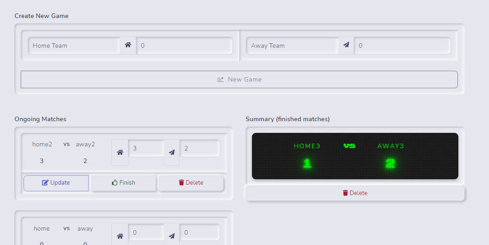

## SportRadar Task (Coding Challenge)

## Demo
- You can check the live demo from here https://dreamy-tulumba-a025b3.netlify.app/
## Screenshot:

### Tools
- **[ReactJs](https://reactjs.org/)**
- **[Redux](https://redux.js.org/)**
- **[Redux-toolkit](https://redux-toolkit.js.org/)**
- **[Typescript](https://www.typescriptlang.org/)**
- **[redux-persist](https://www.npmjs.com/package/redux-persist)**
  
  
# How to run 
- Run frontend (react js) project
  `npm install`
  `npm start`
  
  - Run tests
  `npm test`

Try localhost/3000

 

 

 
